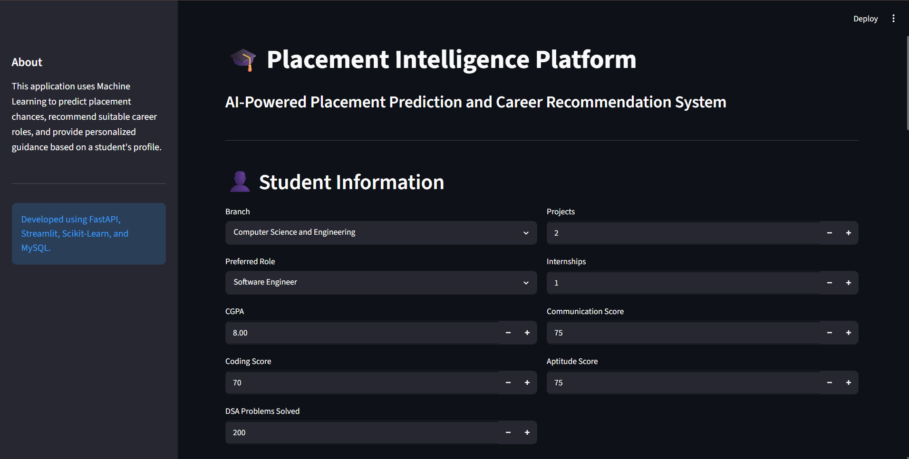
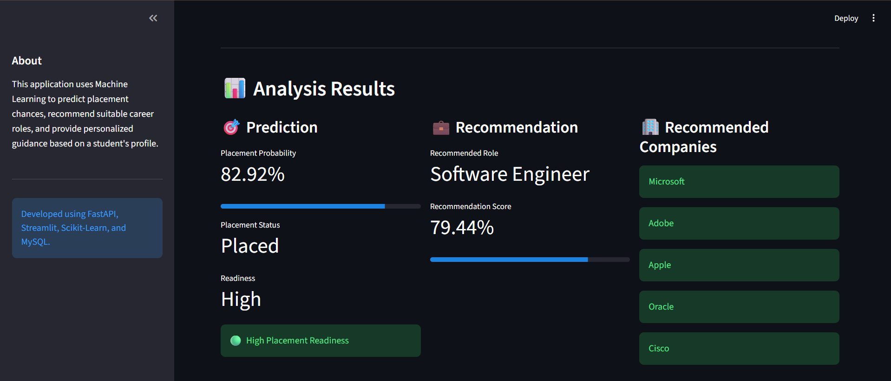
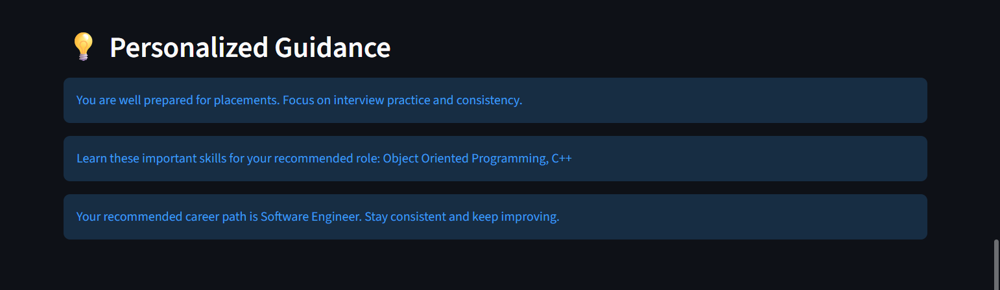
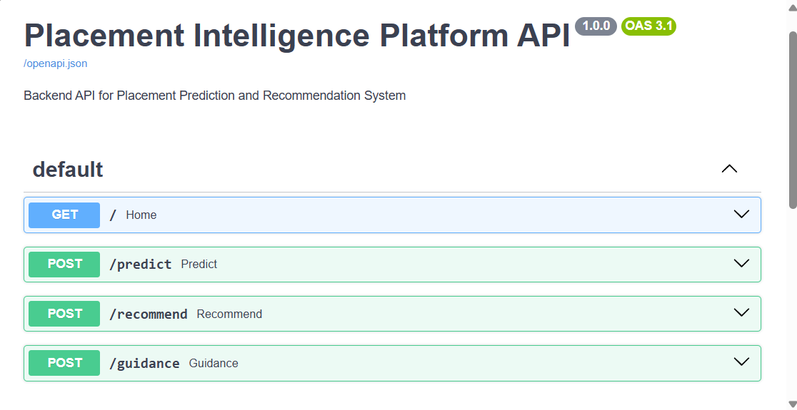

# 🎓 Placement Intelligence Platform

<div align="center">

### AI-Powered Placement Prediction & Career Recommendation Platform

Predict placement outcomes, recommend suitable career roles, identify skill gaps, and generate personalized career guidance using Machine Learning.


</div>

---

## 📌 Project Overview

The Placement Intelligence Platform is an end-to-end AI-powered placement assistance system designed to help students evaluate their placement readiness.

The platform combines **Machine Learning**, **FastAPI**, **Streamlit**, and **MySQL** to provide:

- 🎯 Placement Prediction
- 💼 Career Role Recommendation
- 🏢 Company Recommendation
- 📊 Placement Readiness Assessment
- 📚 Skill Gap Analysis
- 💡 Personalized Career Guidance

The project follows a complete machine learning pipeline—from relational database design and synthetic dataset generation to exploratory data analysis, model development, backend API implementation, and interactive frontend deployment.


## ✨ Features

- 🎯 Placement prediction using Random Forest
- 📈 Placement probability estimation
- 📊 Placement readiness assessment
- 💼 Career role recommendation
- 🏢 Company recommendation
- 📚 Skill gap identification
- 💡 Personalized guidance generation
- 🌐 REST API using FastAPI
- 🖥 Interactive Streamlit dashboard
- 🗄 MySQL relational database
- 📊 Exploratory Data Analysis
- 📁 Modular project architecture


## 🛠 Tech Stack

| Category | Technologies |
|----------|--------------|
| Programming | Python |
| Database | MySQL |
| Machine Learning | Scikit-Learn, Pandas, NumPy |
| Backend | FastAPI |
| Frontend | Streamlit |
| Visualization | Matplotlib, Plotly |
| Development | Jupyter Notebook, Git, GitHub |


## 📂 Project Structure

```text
Placement-Intelligence-Platform
│
├── backend/
│   ├── app/
│   └── models/
│
├── frontend/
│
├── database/
│
├── dataset/
│
├── models/
│
├── notebooks/
│   ├── 01_Database_Setup.ipynb
│   ├── 02_Dataset_Generation.ipynb
│   ├── 03_EDA.ipynb
│   ├── 04_Machine_Learning.ipynb
│   └── 05_System_Validation.ipynb
│
├── screenshots/
│
├── requirements.txt
│
└── README.md
```


## 📸 Screenshots

### Home Screen



---

### Placement Prediction



---

### Personalized Guidance



---

### FastAPI Documentation




## 🤖 Machine Learning

The following classification algorithms were evaluated:

- Logistic Regression
- Decision Tree
- Random Forest
- Gradient Boosting

After comparative evaluation, **Random Forest** was selected as the production model because it achieved the strongest overall performance on the generated dataset.

The model predicts:

- Placement Status
- Placement Probability
- Placement Readiness


## 🚀 Future Improvements

Version 2 roadmap:

- Authentication System
- Resume Analysis
- Package Prediction
- Skill Matching Visualization
- Placement Officer Dashboard
- Student Dashboard
- Docker Support
- Cloud Deployment
- Automated Model Retraining


## 👨‍💻 Author

**Nayandeep Das**

B.Tech Computer Science & Engineering

National Institute of Technology Durgapur

GitHub: https://github.com/nayandeep-das


